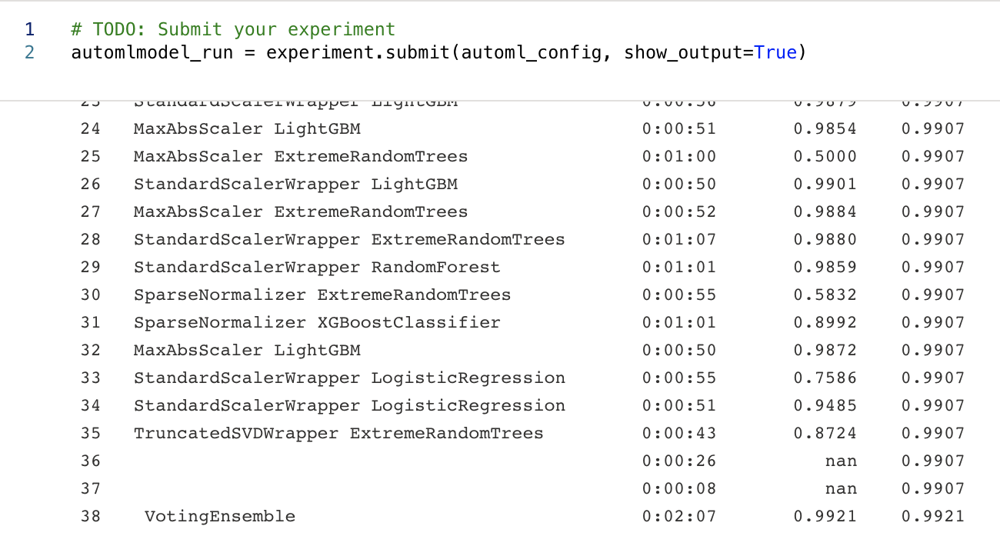
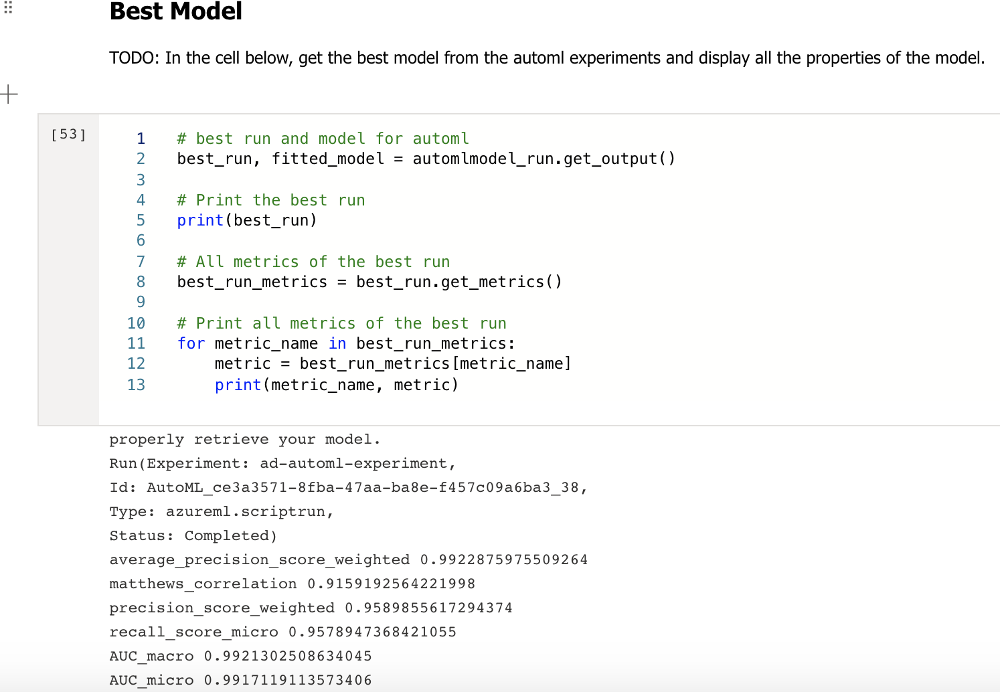
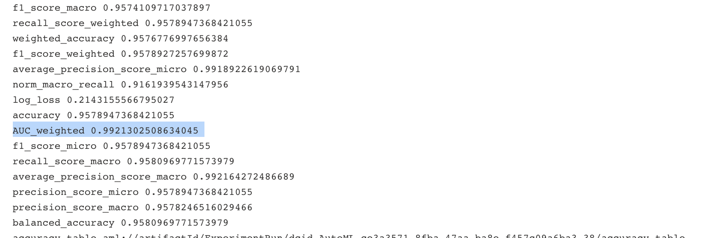
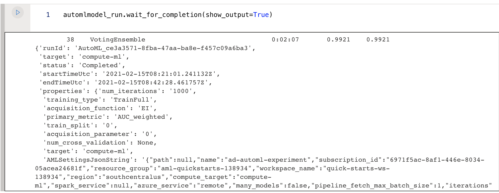
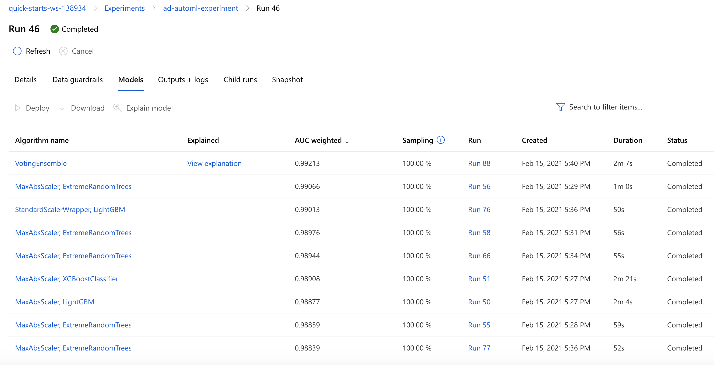
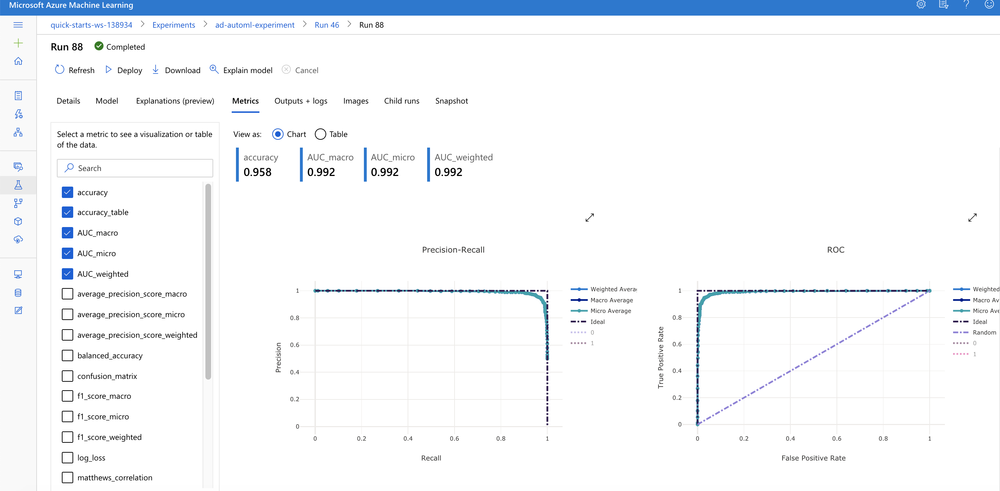
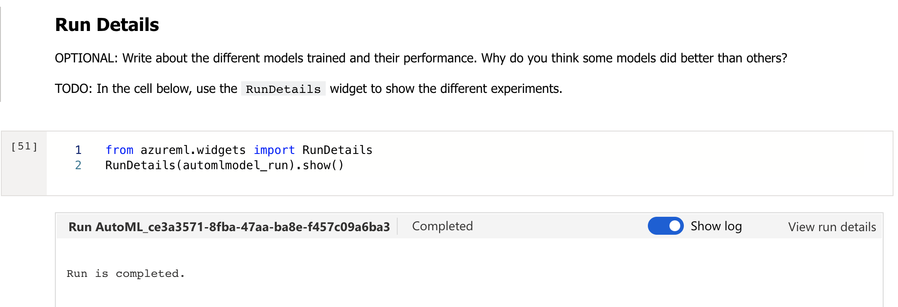
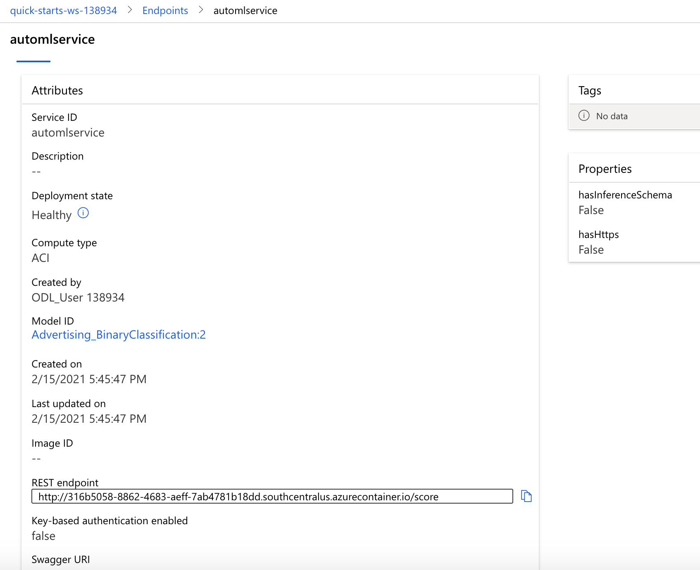
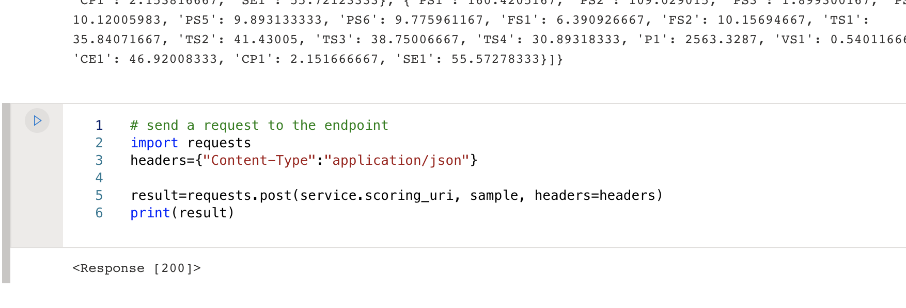

# Udacity Microsoft Azure Capstone Project

This is the capstone project, the part of Udacity Azure Machine Learning Engineer Nanodegree. In this project, we will train models using AutoML and HyperDrive.

* [AutoML](https://docs.microsoft.com/en-us/azure/machine-learning/concept-automated-ml)

Without domain knowledge or resources, we can build machine learning models by using AutoML. By just loading the training data, AutoML will automatically build models and do all the relevant required jobs then we can easily check top algorithms, hyperparameters, feature importance and many other useful information.

* [HyperDrive](https://docs.microsoft.com/en-us/azure/machine-learning/how-to-tune-hyperparameters)

We can automate hyperparameter tuning by using Azure Machine Learning HyperDrive. To enable HyperDrive with AzureML SDK, we have to:
1) Define the parameter search space
2) Specify a primary metric to optimize
3) Specify early termination policy for low-performing runs
4) Allocate resources
5) Launch an experiment with the defined configuration
6) Visualize the training runs
6) Select the best configuration for your model

## Dataset

### Overview

The advertising dataset comes from [kaggle](https://www.kaggle.com/fayomi/advertising). This dataset has a purpose to predict whether a user clicked on Ad or not. 9 input parameters are ready to predict the behavior. 4 numerical values, 1 nlp text, 3 categorical values and 1 datetime value.

### Task

Here, for the better analysis, I split the Timestamp column into Month, Date, Hour, Minute and Second parameters. I remove the Year information since all records have the same year information.

As a result, there are 13 input parameters like below.
- Daily Time Spent on Site : the total minutes of daily time spent on site (Numeric)
- Age : the age of the user (Numeric)
- Area Income : the area income where the user lives (Numeric)
- Daily Internet Usage : the total minutes of daily internet time (Numeric)
- Ad Topic Line : the nlp text of the ad topic (Text)
- City : the city where the user lives (Categorical)
- Male : the gender of the user (Categorical)
- Country : the country of the user (Categorical)
- Month : the month of the datetime value
- Date : the date of the datetime value
- Hour : the hour of the datetime value
- Minute : the minute of the datetime value
- Second : the second of the datetime value

Our target column is "Clicked on Ad". Here we will predict whether a user clicked on Ad or not based on input parameters above.

Total 1,000 records so 950 records are used to train models and 50 records are remain as test dataset.

### Access
We can access to the dataset by using a TabularDataset class of Azure ML to represent tabular data in delimited files (e.g. CSV and TSV). You can check more details from [here](https://docs.microsoft.com/en-us/python/api/azureml-core/azureml.data.dataset_factory.tabulardatasetfactory?view=azure-ml-py#from-delimited-files-path--validate-true--include-path-false--infer-column-types-true--set-column-types-none--separator------header-true--partition-format-none--support-multi-line-false--empty-as-string-false--encoding--utf8--)

## Automated ML
For AutoML settings and configurations,

1) Create the Azure ML Compute instance. Here I set the vm size as [Standard_DS12_v2](https://docs.microsoft.com/en-us/azure/virtual-machines/dv2-dsv2-series-memory) with max_nodes as 4. This instances is the memory optimized type and it consists of 4 vCPU, 28 GB Memory, 56 GB SSD Storage and 16 Data Disks. Max cached & temp storage IOPS/Mbps throughput is 16000/128 in 144 GB cache size and max uncached disk IOPS/Mbps throughput is 128000/192, Max NICs (Network Interface Card) are 4 and network bandwidth is 3000 Mbps.


2) automl_settings and automl_config
```
automl_settings = {
    "experiment_timeout_minutes": 20,
    "max_concurrent_iterations": 5,
    "primary_metric" : 'AUC_weighted'
}
```

```
automl_config = AutoMLConfig(compute_target=compute_target,
                             task = "classification",
                             training_data=dataset,
                             label_column_name="Clicked on Ad",   
                             path = project_folder,
                             enable_early_stopping= True,
                             featurization= 'auto',
                             debug_log = "automl_errors.log",
                             enable_onnx_compatible_models=True,
                             **automl_settings
                            )
```

For more information for automl_settings and automl_config, please click [here](https://docs.microsoft.com/en-us/python/api/azureml-train-automl-client/azureml.train.automl.automlconfig.automlconfig?view=azure-ml-py#constructor).

### Results
*TODO*: What are the results you got with your automated ML model? What were the parameters of the model? How could you have improved it?

*TODO* Remeber to provide screenshots of the `RunDetails` widget as well as a screenshot of the best model trained with it's parameters.

The AutoML best model algorithm is VotingEnsemble which shows 0.9921 AUC weighted score among other alogorithms.


The other metrics results for this best run is like below.




Parameters for this VotingEnsemble model are like below.


Also you can check the dashboard result.




Run Details


AutoML models can be improved by adding more training data or try to add more meaningful input parameters by modifying existing parameters. Also we can try different values for automl settings and configurations.

## Hyperparameter Tuning
*TODO*: What kind of model did you choose for this experiment and why? Give an overview of the types of parameters and their ranges used for the hyperparameter search


### Results
*TODO*: What are the results you got with your model? What were the parameters of the model? How could you have improved it?

*TODO* Remeber to provide screenshots of the `RunDetails` widget as well as a screenshot of the best model trained with it's parameters.

## Model Deployment

The best model is deployed via [Azure Container Instance](https://docs.microsoft.com/en-us/azure/container-instances/container-instances-overview). You can check more details from [here](https://docs.microsoft.com/en-us/python/api/azureml-core/azureml.core.webservice.aci.aciwebservice?view=azure-ml-py).

This will help to create the endpoint of the scoring url.


Tested the sample 5 records from test dataset.


## Screen Recording
*TODO* Provide a link to a screen recording of the project in action. Remember that the screencast should demonstrate:
- A working model
- Demo of the deployed  model
- Demo of a sample request sent to the endpoint and its response

## Standout Suggestions
We can convert the model to [ONNX](https://docs.microsoft.com/en-us/azure/machine-learning/concept-onnx). 

To enable the ONNX, from `automl_config`, `enable_onnx_compatible_models` value should be set as True. Then this can be implemented like below.


