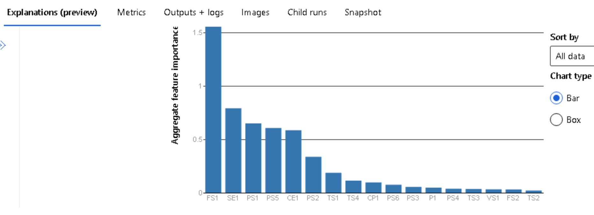
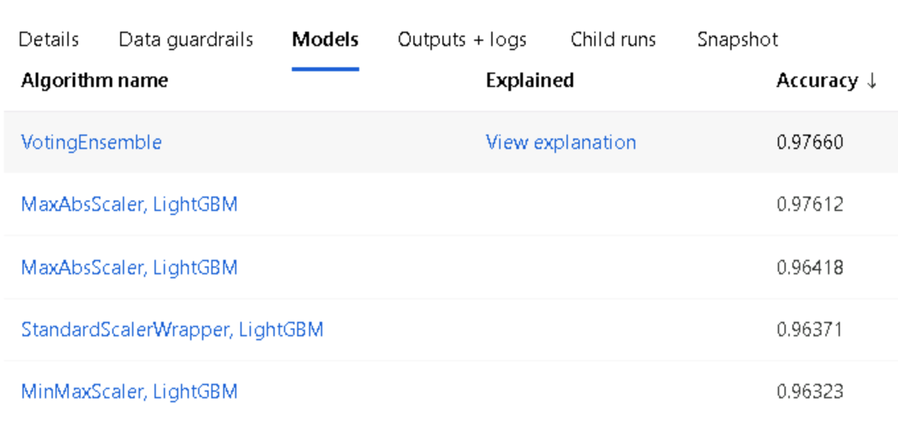

# Udacity Microsoft Azure Capstone Project Overview

This is the capstone project, the part of Udacity Azure Machine Learning Engineer Nanodegree. In this project, we will train models using AutoML and HyperDrive.

* [AutoML](https://docs.microsoft.com/en-us/azure/machine-learning/concept-automated-ml)

Without domain knowledge or resources, we can build machine learning models by using AutoML. By just loading the training data, AutoML will automatically build models and do all the relevant required jobs then we can easily check top algorithms, hyperparameters, feature importance and many other useful information.

* [HyperDrive](https://docs.microsoft.com/en-us/azure/machine-learning/how-to-tune-hyperparameters)

We can automate hyperparameter tuning by using Azure Machine Learning HyperDrive. To enable HyperDrive with AzureML SDK, we have to:
1) Define the parameter search space
2) Specify a primary metric to optimize
3) Specify early termination policy for low-performing runs
4) Allocate resources
5) Launch an experiment with the defined configuration
6) Visualize the training runs
6) Select the best configuration for your model

In this project, we build and optimize an Azure ML pipeline using the Python SDK and a provided Scikit-learn model. This model is then compared to an Azure AutoML run. In the Azure Machine Learning Python SDK, within the machine learning workspace and relevant compute cluster, we can easily load data, pre-process data, tune hyperparameters, train models, choose the best model, register the best model and call the ML endpoint. Especially with HyperDrive, the hyperparmeter optimization can be automated and with AutoML, all the ML lifecycle can be automated.


## Dataset

### Overview

The condition monitoring of hydraulic systems dataset comes from [UCI](https://archive.ics.uci.edu/ml/datasets/Condition+monitoring+of+hydraulic+systems). This dataset has a purpose to predict cooler condition, valve condition, internal pump leakage, hydrualic accumulator / bar pressure and stability. In this project, we will predict the stability whether the static conditions have been reached or not. This experiment can be considered to belong to the topic of Predictive Maintenance. Predictive maintenance is maintenance that monitors the performance and condition of equipments during operation to reduce the system failures. 

### Task

Here, for the better analysis, I create the training and test dataset from original data. Total 2094 records of training data and 111 records of test data.

The data set contains 17 sensors data like below:

- PS1 Pressure bar 100 Hz
- PS2 Pressure bar 100 Hz
- PS3 Pressure bar 100 Hz
- PS4 Pressure bar 100 Hz
- PS5 Pressure bar 100 Hz
- PS6 Pressure bar 100 Hz
- EPS1 Motor power W 100 Hz
- FS1 Volume flow l/min 10 Hz
- FS2 Volume flow l/min 10 Hz
- TS1 Temperature °C 1 Hz
- TS2 Temperature °C 1 Hz
- TS3 Temperature °C 1 Hz
- TS4 Temperature °C 1 Hz
- VS1 Vibration mm/s 1 Hz
- CE Cooling efficiency (virtual) % 1 Hz
- CP Cooling power (virtual) kW 1 Hz
- SE Efficiency factor % 1 Hz

The target values are like below and in this project, we will predict the stable flag, "STABILITY".

1: Cooler condition / %:
3: close to total failure
20: reduced effifiency
100: full efficiency

2: Valve condition / %:
100: optimal switching behavior
90: small lag
80: severe lag
73: close to total failure

3: Internal pump leakage:
0: no leakage
1: weak leakage
2: severe leakage

4: Hydraulic accumulator / bar:
130: optimal pressure
115: slightly reduced pressure
100: severely reduced pressure
90: close to total failure

5: stable flag:
0: conditions were stable
1: static conditions might not have been reached yet

### Access
We can access to the dataset by using a TabularDataset class of Azure ML to represent tabular data in delimited files (e.g. CSV and TSV). You can check more details from [here](https://docs.microsoft.com/en-us/python/api/azureml-core/azureml.data.dataset_factory.tabulardatasetfactory?view=azure-ml-py#from-delimited-files-path--validate-true--include-path-false--infer-column-types-true--set-column-types-none--separator------header-true--partition-format-none--support-multi-line-false--empty-as-string-false--encoding--utf8--)

## Automated ML
For AutoML settings and configurations,

1) Create the Azure ML Compute instance. Here I set the vm size as [Standard_DS12_v2](https://docs.microsoft.com/en-us/azure/virtual-machines/dv2-dsv2-series-memory) with max_nodes as 4. This instances is the memory optimized type and it consists of 4 vCPU, 28 GB Memory, 56 GB SSD Storage and 16 Data Disks. Max cached & temp storage IOPS/Mbps throughput is 16000/128 in 144 GB cache size and max uncached disk IOPS/Mbps throughput is 128000/192, Max NICs (Network Interface Card) are 4 and network bandwidth is 3000 Mbps.


2) automl_settings and automl_config

We can manage experiment timeout, max concurrent iterations so that we can manage overall experiment time. If these values are needed to be set as high values, then we can consider improve the compute cluster spec. Also the primary metric can be set as different based on the model's traits.

```
automl_settings = {
    "experiment_timeout_minutes": 60,
    "max_concurrent_iterations": 20,
    "primary_metric" : 'accuracy'
}
```

In the automl_config, we can define configurations for automl runs. We can set the task whether this is the classification problem or not, can block certain models and enable early stopping.

```
automl_config = AutoMLConfig(compute_target=compute_target,
                             task = "classification",
                             training_data=dataset,
                             label_column_name="STABILITY",
                             blocked_models=['XGBoostClassifier'],
                             path = project_folder,
                             enable_early_stopping= True,
                             featurization= 'auto',
                             debug_log = "automl_errors.log",
                             enable_onnx_compatible_models=True,
                             **automl_settings
                            )
```

For more information for automl_settings and automl_config, please click [here](https://docs.microsoft.com/en-us/python/api/azureml-train-automl-client/azureml.train.automl.automlconfig.automlconfig?view=azure-ml-py#constructor).

### Results

The AutoML best model algorithm is VotingEnsemble which shows about 0.9766 score among other alogorithms.


The other metrics results for this best run is like below.


Run Details


The best AutoML pipeline is VotingEnsemble and hyperparameters are automatically controlled by AutoML since AutoML does data preprocessing, model selection and hyperparameter optimization, which is the end to end automated machine learning lifecycle solution.

* [VotingEnsemble](https://docs.microsoft.com/en-us/azure/machine-learning/concept-automated-ml#ensemble)

Automated machine learning supports ensemble models, which are enabled by default. Ensemble learning improves machine learning results and predictive performance by combining multiple models as opposed to using single models. 

VotingEnsemble predicts based on the weighted average of predicted class probabilities for classification tasks or predicted regression targets for regression tasks.

AutoML selected VotingEnsemble Classifier parameters like below. You can check explanations for parameters from the [sklearn.ensemble.VotingClassifier](https://scikit-learn.org/stable/modules/generated/sklearn.ensemble.VotingClassifier.html) documentation since [PreFittedSoftVotingClassifier](https://docs.microsoft.com/en-us/python/api/azureml-automl-runtime/azureml.automl.runtime.shared.model_wrappers.prefittedsoftvotingclassifier?view=azure-ml-py) Class of Azureml is the inheritance of sklearn.ensemble._voting.VotingClassifier.

```
- weights: [0.5555555555555556,
            0.1111111111111111,
            0.1111111111111111,
            0.1111111111111111,
            0.1111111111111111]))]
- flatten_transform : None
- verbose : False
```

## Hyperparameter Tuning

In this project, LogisticRegression is used. Logistic regression is used to predict a certain class such as 1 or 0, yes or no. There 3 types of logistic regression. 
1) Binary Logistic Regression
2) Multinomial Logistic Regression
3) Ordinal Logistic Regression.

In this experiment, we will predict whether this system is stable or not so this can be the binary logistic regression experiment.

For more explanation, you can refer to the [scikit learn documentation](https://scikit-learn.org/stable/modules/generated/sklearn.linear_model.LogisticRegression.html).

- Early termination policy
```
early_termination_policy = BanditPolicy(slack_factor = 0.1, evaluation_interval=1, delay_evaluation=5)
```
[Bandit policy](https://docs.microsoft.com/en-us/azure/machine-learning/how-to-tune-hyperparameters) is based on slack factor/slack amount and evaluation interval. Bandit ends runs when the primary metric isn't within the specified slack factor/slack amount of the most successful run.

- Parameter setting

We can set `C` and `max_iter` values in the Logistic Regression model. You can explore more parameters from the [Scikit-learn Logistic Regression](https://scikit-learn.org/stable/modules/generated/sklearn.linear_model.LogisticRegression.html) Documentation.

```
param_sampling = RandomParameterSampling( {
        "--C": uniform(0.001, 1.0),
        "--max_iter": choice(100,125,150,175,200)
    }
)
```

`C` is the inverse of regularization strength, so small values specify stronger regularization.

`max_iter` is the maximum number of iterations taken for the solvers to converge.

[Random sampling](https://docs.microsoft.com/en-us/azure/machine-learning/how-to-tune-hyperparameters) supports discrete and continuous hyperparameters. It supports early termination of low-performance runs. Some users do an initial search with random sampling and then refine the search space to improve results.

In random sampling, hyperparameter values are randomly selected from the defined search space.

- Hyperdrive run configuration
```
hyperdrive_run_config = HyperDriveConfig(estimator=estimator,
                                hyperparameter_sampling=param_sampling,
                                policy=early_termination_policy,
                                primary_metric_name='Accuracy',
                                primary_metric_goal=PrimaryMetricGoal.MAXIMIZE,
                                max_total_runs=10)
```

[HyperDriveConfig](https://docs.microsoft.com/en-us/python/api/azureml-train-core/azureml.train.hyperdrive.hyperdriveconfig?view=azure-ml-py) includes information about hyperparameter space sampling, termination policy, primary metric, resume from configuration, estimator, and the compute target to execute the experiment runs on. 

### Results

- Best Model Run

The accuracy is 0.914 and the `--C` value is 0.45 and `--max_iter` is 200. Here, to improve the hyper drive experiment, we can add more Logistic Regression parameters or change hyper drive config parameters to produce different results.


- Run Details

In this run detail, we can check runId, status, accuracy score and other hyperdrive run related details.


## Model Deployment

The best model is deployed via [Azure Container Instance](https://docs.microsoft.com/en-us/azure/container-instances/container-instances-overview). You can check more details from [here](https://docs.microsoft.com/en-us/python/api/azureml-core/azureml.core.webservice.aci.aciwebservice?view=azure-ml-py).

This will help to create the endpoint of the scoring url.


Test the sample json by sending the sample json request to the scoring uri.


We can call the deployed machine learning service by sending sample json data to the scoring uri with valid headers. You can check the sample code from [here](https://docs.microsoft.com/en-us/azure/machine-learning/how-to-consume-web-service?tabs=python#call-the-service-python)

## Screen Recording
Click [here](https://www.youtube.com/watch?v=cfDbGIGjFdI) to watch the explanations

- A working model
- Demo of the deployed  model
- Demo of a sample request sent to the endpoint and its response

## Future Improvement Suggestions
* AutoML Experiment
To improve the AutoML experiment result, we can try different performance metric such as AUC weighted. 

Also we can remove less relevant features among 17 input parameters. Firstly, except top 10 features and exclude other 7 features which has low importance.




* HyperDrive Experiment
Since we select the logistic regression model and tune `C` and `max_iter` values, we can try to tune other additional values such as `penalty`, `dual`, `tol`, `fit_intercept`, `intercept_scaling`, `class_weight`, `random_state`, `solver`, `verbose` and `l1_ratio`. Please refer to the [scikit learn documentation](https://scikit-learn.org/stable/modules/generated/sklearn.linear_model.LogisticRegression.html) for parameters explanations.

Or we can try different binary classification model such as [k-Nearest Neighbors](https://scikit-learn.org/stable/modules/generated/sklearn.neighbors.KNeighborsClassifier.html), [Decision Trees](https://scikit-learn.org/stable/modules/generated/sklearn.tree.DecisionTreeClassifier.html) and [SVM](https://scikit-learn.org/stable/modules/generated/sklearn.svm.SVC.html).

We can consider the insight from AutoML result by applying [VotingEnsemble](https://scikit-learn.org/stable/modules/generated/sklearn.ensemble.VotingClassifier.html) or [LightGBM](https://lightgbm.readthedocs.io/en/latest/pythonapi/lightgbm.LGBMClassifier.html) since they showed high performance.



## Standout Suggestions
We can convert the model to [ONNX](https://docs.microsoft.com/en-us/azure/machine-learning/concept-onnx). 

To enable the ONNX, from `automl_config`, `enable_onnx_compatible_models` value should be set as True. Then this can be implemented like below.


