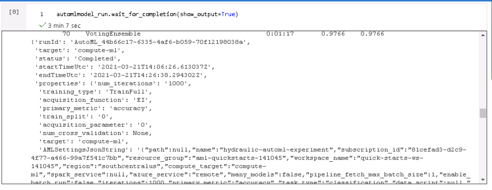
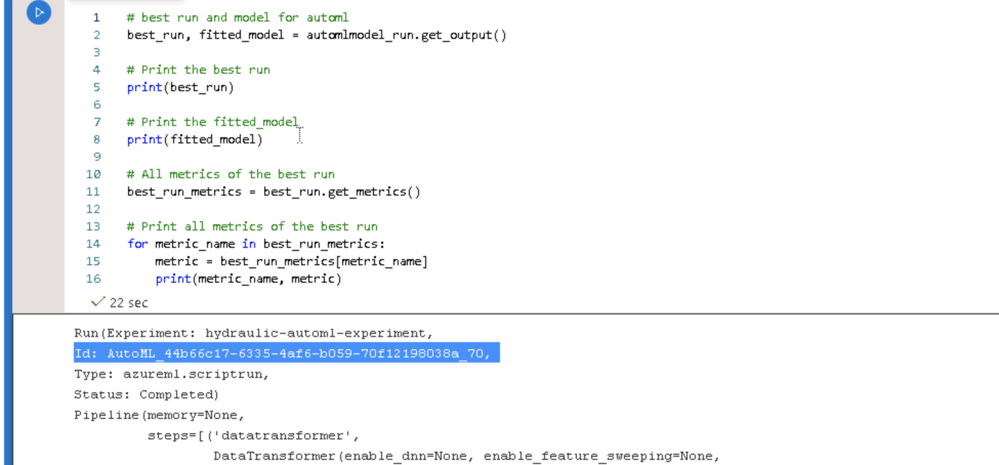
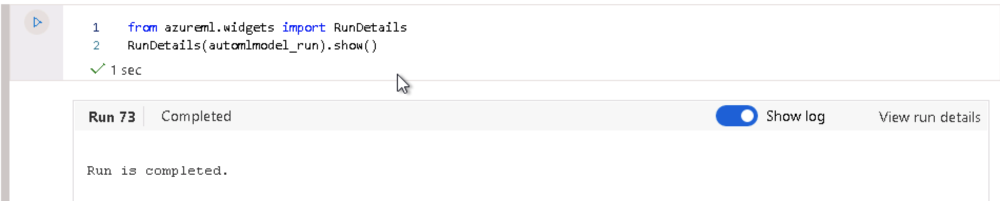
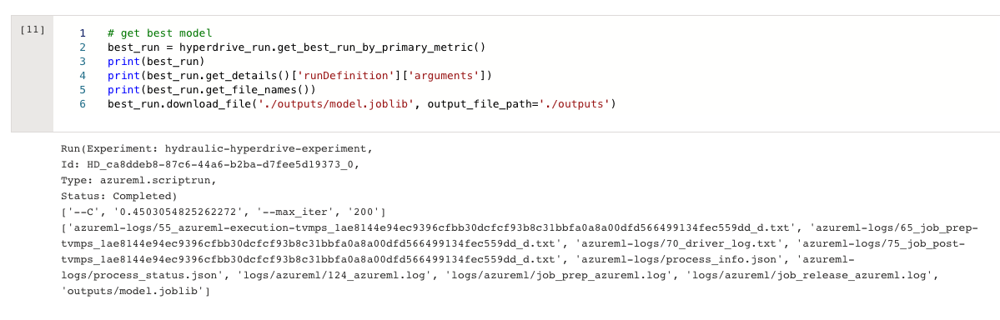
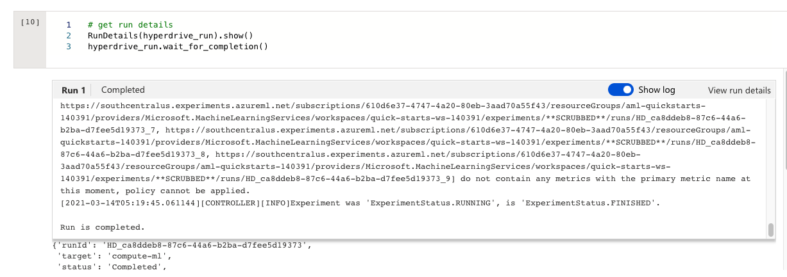

# Udacity Microsoft Azure Capstone Project

This is the capstone project, the part of Udacity Azure Machine Learning Engineer Nanodegree. In this project, we will train models using AutoML and HyperDrive.

* [AutoML](https://docs.microsoft.com/en-us/azure/machine-learning/concept-automated-ml)

Without domain knowledge or resources, we can build machine learning models by using AutoML. By just loading the training data, AutoML will automatically build models and do all the relevant required jobs then we can easily check top algorithms, hyperparameters, feature importance and many other useful information.

* [HyperDrive](https://docs.microsoft.com/en-us/azure/machine-learning/how-to-tune-hyperparameters)

We can automate hyperparameter tuning by using Azure Machine Learning HyperDrive. To enable HyperDrive with AzureML SDK, we have to:
1) Define the parameter search space
2) Specify a primary metric to optimize
3) Specify early termination policy for low-performing runs
4) Allocate resources
5) Launch an experiment with the defined configuration
6) Visualize the training runs
6) Select the best configuration for your model

## Dataset

### Overview

The condition monitoring of hydraulic systems dataset comes from [UCI](https://archive.ics.uci.edu/ml/datasets/Condition+monitoring+of+hydraulic+systems). This dataset has a purpose to predict cooler condition, valve condition, internal pump leakage, hydrualic accumulator / bar pressure and stability. In this project, we will predict the stability whether the static conditions have been reached or not.

### Task

Here, for the better analysis, I create the training and test dataset from original data. Total 2094 records of training data and 111 records of test data.

The data set contains 17 sensors data like below:

- PS1 Pressure bar 100 Hz
- PS2 Pressure bar 100 Hz
- PS3 Pressure bar 100 Hz
- PS4 Pressure bar 100 Hz
- PS5 Pressure bar 100 Hz
- PS6 Pressure bar 100 Hz
- EPS1 Motor power W 100 Hz
- FS1 Volume flow l/min 10 Hz
- FS2 Volume flow l/min 10 Hz
- TS1 Temperature °C 1 Hz
- TS2 Temperature °C 1 Hz
- TS3 Temperature °C 1 Hz
- TS4 Temperature °C 1 Hz
- VS1 Vibration mm/s 1 Hz
- CE Cooling efficiency (virtual) % 1 Hz
- CP Cooling power (virtual) kW 1 Hz
- SE Efficiency factor % 1 Hz

The target values are like below and in this project, we will predict the stable flag, "STABILITY".

1: Cooler condition / %:
3: close to total failure
20: reduced effifiency
100: full efficiency

2: Valve condition / %:
100: optimal switching behavior
90: small lag
80: severe lag
73: close to total failure

3: Internal pump leakage:
0: no leakage
1: weak leakage
2: severe leakage

4: Hydraulic accumulator / bar:
130: optimal pressure
115: slightly reduced pressure
100: severely reduced pressure
90: close to total failure

5: stable flag:
0: conditions were stable
1: static conditions might not have been reached yet

### Access
We can access to the dataset by using a TabularDataset class of Azure ML to represent tabular data in delimited files (e.g. CSV and TSV). You can check more details from [here](https://docs.microsoft.com/en-us/python/api/azureml-core/azureml.data.dataset_factory.tabulardatasetfactory?view=azure-ml-py#from-delimited-files-path--validate-true--include-path-false--infer-column-types-true--set-column-types-none--separator------header-true--partition-format-none--support-multi-line-false--empty-as-string-false--encoding--utf8--)

## Automated ML
For AutoML settings and configurations,

1) Create the Azure ML Compute instance. Here I set the vm size as [Standard_DS12_v2](https://docs.microsoft.com/en-us/azure/virtual-machines/dv2-dsv2-series-memory) with max_nodes as 4. This instances is the memory optimized type and it consists of 4 vCPU, 28 GB Memory, 56 GB SSD Storage and 16 Data Disks. Max cached & temp storage IOPS/Mbps throughput is 16000/128 in 144 GB cache size and max uncached disk IOPS/Mbps throughput is 128000/192, Max NICs (Network Interface Card) are 4 and network bandwidth is 3000 Mbps.


2) automl_settings and automl_config
```
automl_settings = {
    "experiment_timeout_minutes": 60,
    "max_concurrent_iterations": 20,
    "primary_metric" : 'accuracy'
}
```

```
automl_config = AutoMLConfig(compute_target=compute_target,
                             task = "classification",
                             training_data=dataset,
                             label_column_name="STABILITY",
                             blocked_models=['XGBoostClassifier'],
                             path = project_folder,
                             enable_early_stopping= True,
                             featurization= 'auto',
                             debug_log = "automl_errors.log",
                             enable_onnx_compatible_models=True,
                             **automl_settings
                            )
```

For more information for automl_settings and automl_config, please click [here](https://docs.microsoft.com/en-us/python/api/azureml-train-automl-client/azureml.train.automl.automlconfig.automlconfig?view=azure-ml-py#constructor).

### Results

The AutoML best model algorithm is VotingEnsemble which shows 0.97755 score among other alogorithms.



The other metrics results for this best run is like below.



Run Details



AutoML models can be improved by adding more training data or try to add more meaningful input parameters by modifying existing parameters. Also we can try different values for automl settings and configurations.

## Hyperparameter Tuning

In this project, LogisticRegression is used. Logistic regression is used to predict a certain class such as 1 or 0, yes or no. There 3 types of logistic regression. 
1) Binary Logistic Regression
2) Multinomial Logistic Regression
3) Ordinal Logistic Regression.

In this experiment, we will predict whether this system is stable or not so this can be the binary logistic regression experiment.

For more explanation, you can refer to the [scikit learn documentation](https://scikit-learn.org/stable/modules/generated/sklearn.linear_model.LogisticRegression.html).

- Early termination policy
```
early_termination_policy = BanditPolicy(slack_factor = 0.1, evaluation_interval=1, delay_evaluation=5)
```
[Bandit policy](https://docs.microsoft.com/en-us/azure/machine-learning/how-to-tune-hyperparameters) is based on slack factor/slack amount and evaluation interval. Bandit ends runs when the primary metric isn't within the specified slack factor/slack amount of the most successful run.

- Parameter setting
```
param_sampling = RandomParameterSampling( {
        "--C": uniform(0.001, 1.0),
        "--max_iter": choice(100,125,150,175,200)
    }
)
```

[Random sampling](https://docs.microsoft.com/en-us/azure/machine-learning/how-to-tune-hyperparameters) supports discrete and continuous hyperparameters. It supports early termination of low-performance runs. Some users do an initial search with random sampling and then refine the search space to improve results.

In random sampling, hyperparameter values are randomly selected from the defined search space.

- Hyperdrive run configuration
```
hyperdrive_run_config = HyperDriveConfig(estimator=estimator,
                                hyperparameter_sampling=param_sampling,
                                policy=early_termination_policy,
                                primary_metric_name='Accuracy',
                                primary_metric_goal=PrimaryMetricGoal.MAXIMIZE,
                                max_total_runs=10)
```

[HyperDriveConfig](https://docs.microsoft.com/en-us/python/api/azureml-train-core/azureml.train.hyperdrive.hyperdriveconfig?view=azure-ml-py) includes information about hyperparameter space sampling, termination policy, primary metric, resume from configuration, estimator, and the compute target to execute the experiment runs on. 

### Results

The accuracy is 0.914 and the `--C` value is 0.967 and `--max_iter` is 100. Here, to improve the hyper drive experiment, we can add more Logistic Regression parameters or change hyper drive config parameters to produce different results.

- Best Model Run


- Run Details



## Model Deployment

The best model is deployed via [Azure Container Instance](https://docs.microsoft.com/en-us/azure/container-instances/container-instances-overview). You can check more details from [here](https://docs.microsoft.com/en-us/python/api/azureml-core/azureml.core.webservice.aci.aciwebservice?view=azure-ml-py).

This will help to create the endpoint of the scoring url.


Tested the sample 5 records from test dataset.


## Screen Recording
Click [here]() to watch the explanations

- A working model
- Demo of the deployed  model
- Demo of a sample request sent to the endpoint and its response

## Standout Suggestions
We can convert the model to [ONNX](https://docs.microsoft.com/en-us/azure/machine-learning/concept-onnx). 

To enable the ONNX, from `automl_config`, `enable_onnx_compatible_models` value should be set as True. Then this can be implemented like below.


